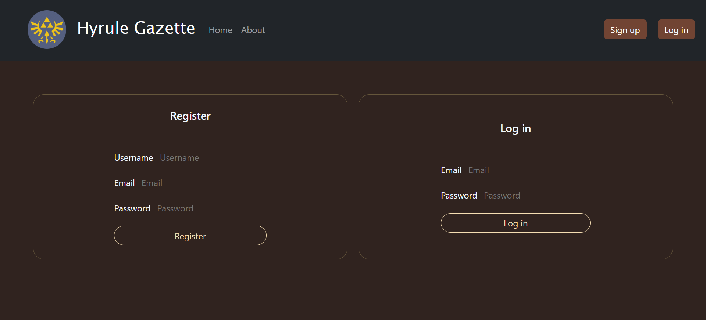

# Hyrule Gazette

Welcome to Hyrule Gazette, a blog application inspired by the legendary world of Zelda! This README provides an overview of the features and instructions on how to run the application locally.

## Table of Contents
1. [Features](#features)
    - [Login and Signup](#login-and-signup)
    - [Create Blogs with "Generate Content"](#create-blogs-with-generate-content)
    - [Delete and Edit Blogs](#delete-and-edit-blogs)
    - [Markdown Format Support](#markdown-format-support)
    - [View Notifications and User Feed](#view-notifications-and-user-feed)
    - [Rate, Comment, and Follow](#rate-comment-and-follow)
    - [Search, Filter, and Pagination](#search-filter-and-pagination)
2. [Running Locally](#running-locally)
3. [API Documentation](#api-documentation)

## Features

### Login and Signup
- Users can create accounts by providing email, username, and password.
- Existing users can log in securely.


### Create Blogs with special "Generate Content" feature
- Craft your blogs with your own header image, title, content and blurb.
- Utilize the special "Generate Content" feature for Zelda-themed inspiration. (Credits to open-source Zelda API https://docs.zelda.fanapis.com/ ).
- Provides a sample image, title, and content generated about Zelda games, dungeons, bosses, and locations.


### Delete and Edit Blogs
- Users have the ability to delete and edit their blog posts at any time.
- Users can also update their profile through the profile page.


### Markdown Format Support
- Write blog content using Markdown format for a rich text experience, which will be displayed accordingly.


### Rate, Comment, and Follow
- Users can rate blog posts, leave comments, and follow their favorite bloggers.


### View Notifications and User Feed
- Stay updated with notifications and view a personalized user feed based on who you are following.


### Search, Filter, and Pagination
- Easily search for specific blog posts by keywords or authors.
- Filter posts based on categories or keywords.
- Navigate through paginated blog posts for a seamless experience.
- Control number of blogs displayed per page.


## Running Locally

To run the application locally, follow these steps:

1. Download the ZIP file and extract it.
2. Navigate to both the `client` folder and `server` folder in the terminal and run the following command in both of them to install packages.
   ```bash
   npm i
   ```
3. Navigate to the root folder and run:
   ```bash
   npm i
   ```
   This will install the necessary packages, including `concurrently`, which is needed to run both frontend and backend simultaneously.
4. In the root folder, run:
   ```bash
   npm start
   ```
   This will concurrently run both the frontend and backend.
   - Frontend is hosted on http://localhost:5000
   - Backend is hosted on http://localhost:3000

## API Documentation

Explore the backend API documentation [here](https://documenter.getpostman.com/view/30902915/2s9YXk4M4F) for details on the API endpoints, the required parameters and headers for each, and the expected response statuses.

Whether you're a seasoned adventurer or an age-old enthusiast, Hyrule Gazette has everything you need to dive into the world of Zelda games.
